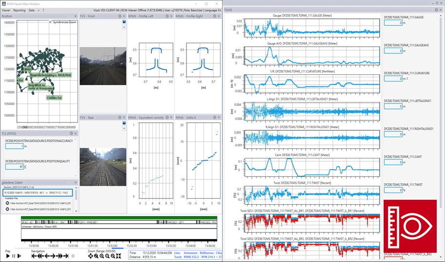

## RCM-DX Viewer

The RCM-DX Viewer is a powerful and versatile application for viewing RCM-DX files. While the release of the source code as Open Source Software is still in the works, you can find the latest binary distribution (.msi) on the [releases page](https://github.com/SchweizerischeBundesbahnen/rcm-dx-viewer/releases) of this repository. 
Please note: To install the RCM-DX Viewer do the following:
1. Install vcredist_2013_x64.exe
2. Install RCM_DX_Viewer_<versionnumber>.msi

### Workspaces

The viewer allows the flexible combination of various views for data presentation, which can be imported and exported as "workspaces". For a quick way to try the viewer, you can import an example workspace from the [workspaces folder](https://github.com/SchweizerischeBundesbahnen/rcm-dx-viewer/tree/main/workspaces). 

### Example data files

- [20220428-114946_DFZ00_TGMS_v003_created-20220429-065432.rcmdx](https://sbb-wcms-big-files-server-prod.s3.eu-central-1.amazonaws.com/RCM-DX_Files/20220428-114946_DFZ00_TGMS_v003_created-20220429-065432.rcmdx) (100MB)
- [20220428-114946_DFZ00_TLS_v001_created-20220429-065432.rcmdx](https://sbb-wcms-big-files-server-prod.s3.eu-central-1.amazonaws.com/RCM-DX_Files/20220428-114946_DFZ00_TLS_v001_created-20220429-065432.rcmdx) (100MB)
- [20220428-114946_DFZ00_TSIMS-RAW-COMP_v001_created-20220429-065432.rcmdx](https://sbb-wcms-big-files-server-prod.s3.eu-central-1.amazonaws.com/RCM-DX_Files/20220428-114946_DFZ00_TSIMS-RAW-COMP_v001_created-20220429-065432.rcmdx) (938MB)
- [20220428-114946_DFZ00_TVS_v001_created-20220429-065432.rcmdx](https://sbb-wcms-big-files-server-prod.s3.eu-central-1.amazonaws.com/RCM-DX_Files/20220428-114946_DFZ00_TVS_v001_created-20220429-065432.rcmdx) (167MB)

## RCM-DX FileFormat
Link to the open file fomat RCM-DX: https://github.com/OpenRailAssociation/rcm-dx
